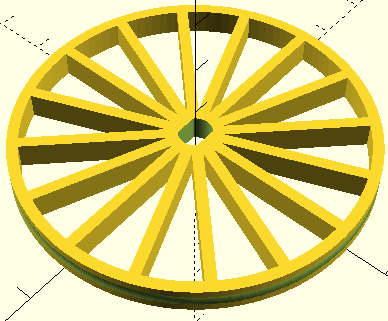
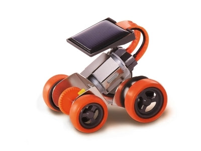
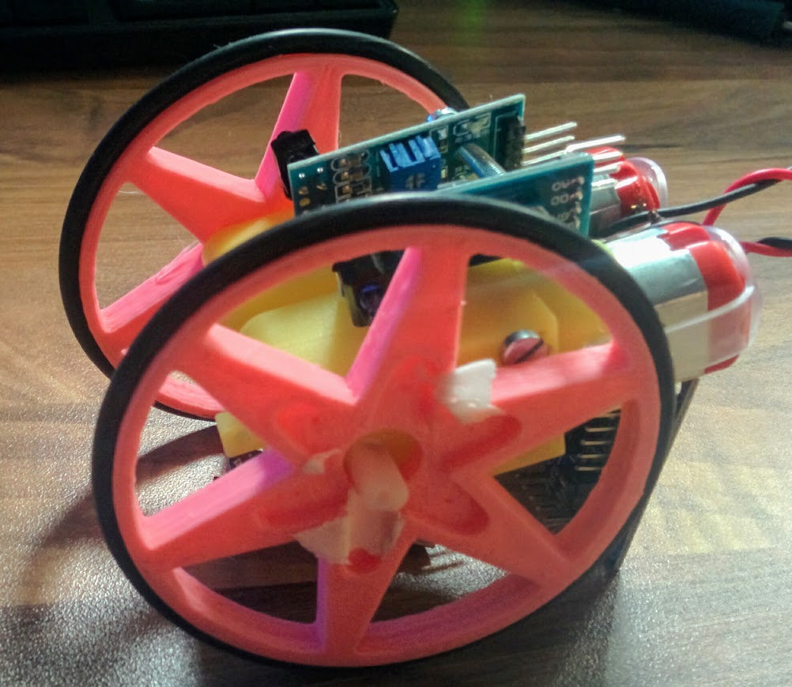
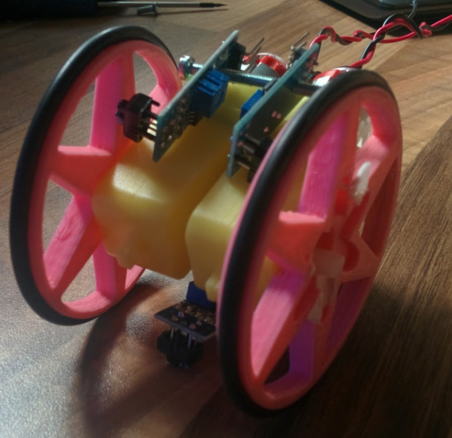
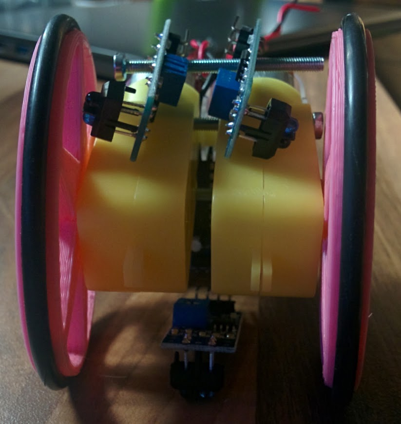
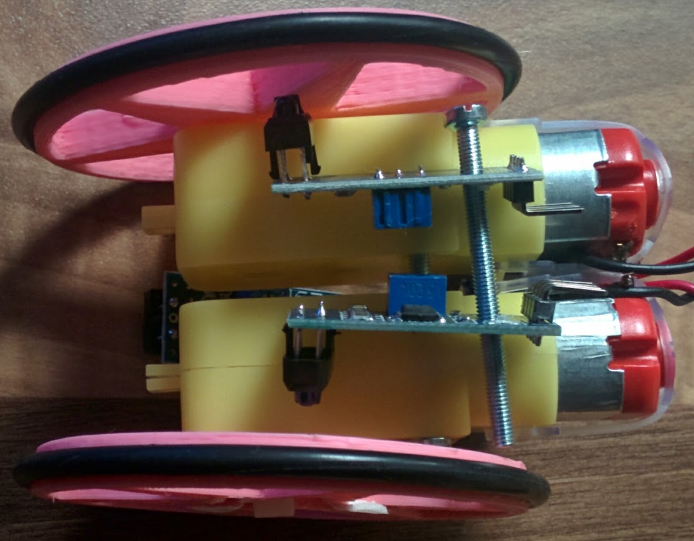

#Small Movil Robot

Se trata de hacer un diseño muy sencillo de robot básico y sobre todo barato

Estaría controlado por un ESP8266 y tendría 2 motores TT Amarillos

Basado en el [diseño de tkbletsc](http://www.thingiverse.com/thing:883165) le he añadido una ranura para la goma [diseño](./Modelos/Rueda_motor_TT.scad)

## Idea

La idea me ha venido al ver un modelo super sencillo de un [coche solar de Cebek](http://www.electan.com/coche-solar-kit-cebekit-p-6619.html)

El precio de 15€ me ha dejado frío y he pensado que se puede diseñar algo similar a una fracción del precio

### Componentes

* 2 motores TT
* Placa controladora de motores: a probar una con L293 y otra con el L1190
* Controlador: ESP8266 (usar una de las ESP12 que hay que soldar)
* Batería: sin duda una 18650
* Sensores tacómetros
* ¿1 Sensor de suelo para siguelíneas? usando A0

### Montaje

* 2 tornillos M3 de al menos 40mm conectan los 2 motores entre sí dando cuerpo
* Entre los 2 cabe el ESP12 o la parte central de la estructura
* Los tacómetros arriba sobre los motores
* La pila abajo para darle estabilidad

### Costes

### Velocidad

### Imágenes

